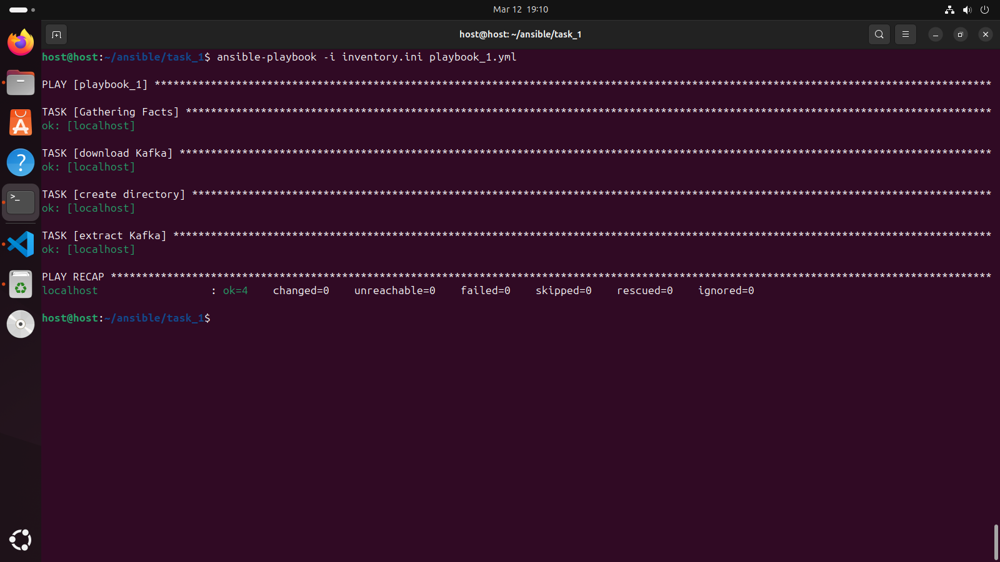
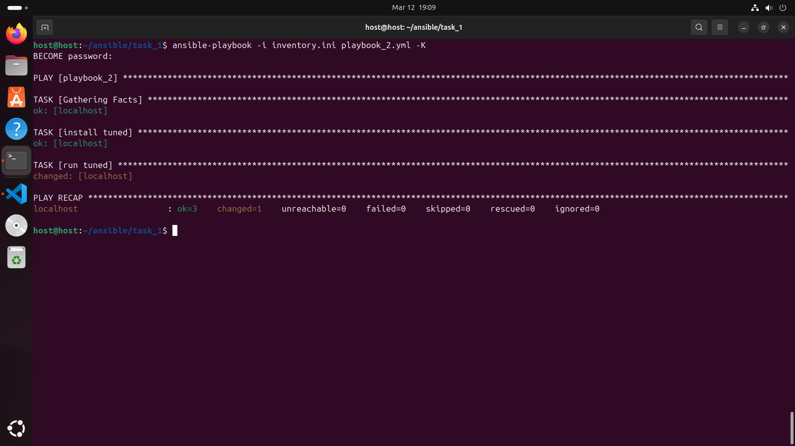
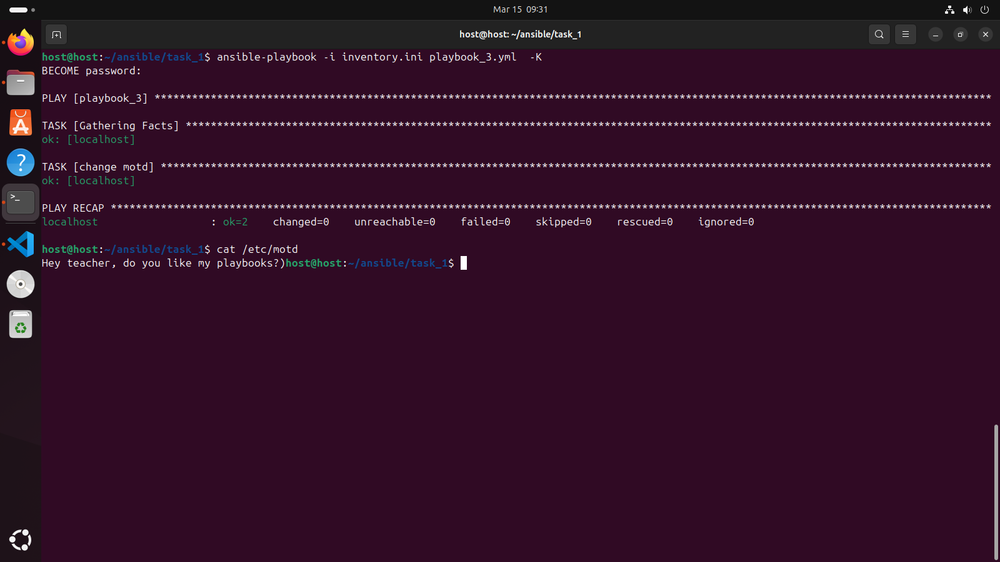
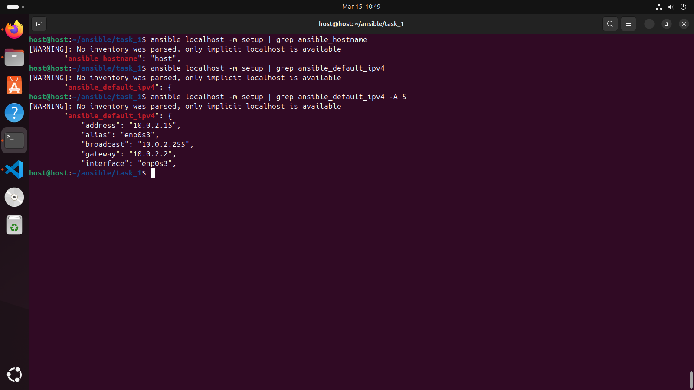
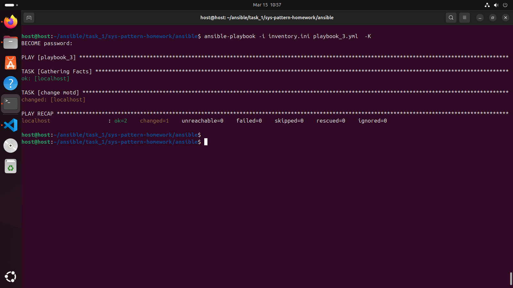
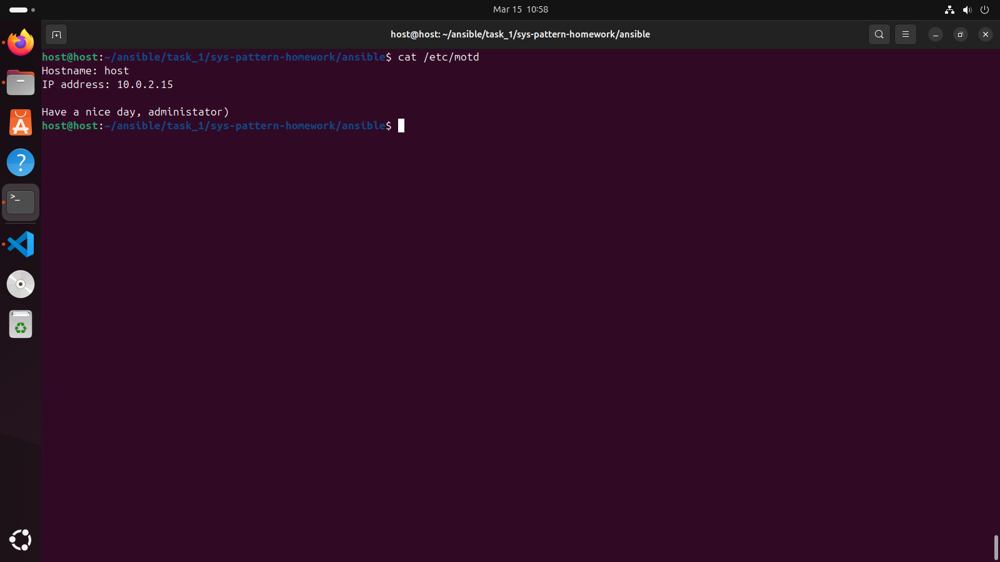
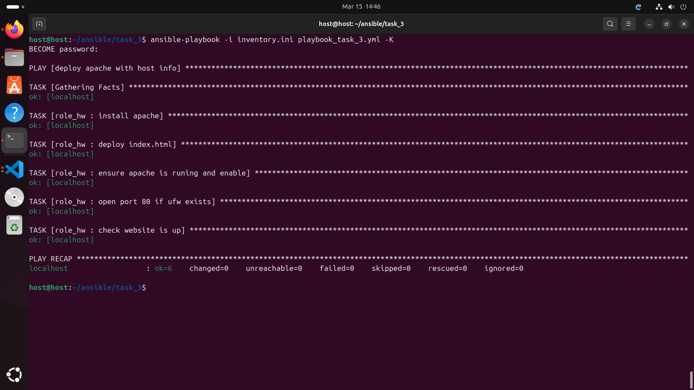
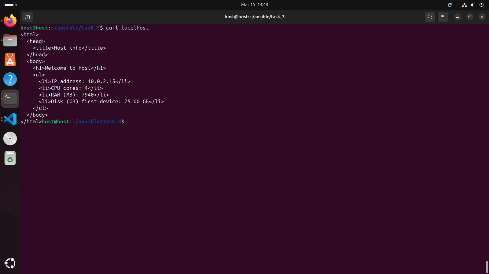
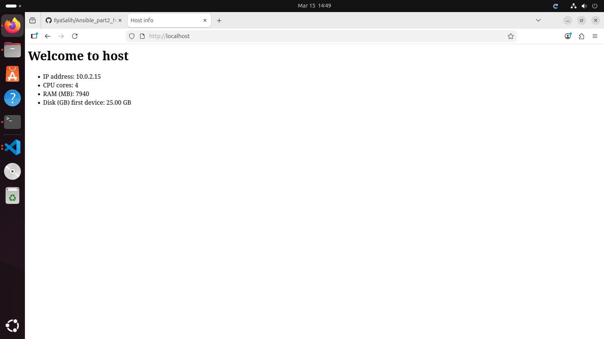

# Домашнее задание к занятию "`Ansible part 2`" - `Salihzyanov Ilyas`

## Задание 1

`Выполните действия, приложите файлы с плейбуками и вывод выполнения.`

`Напишите три плейбука. При написании рекомендуем использовать текстовый редактор с подсветкой синтаксиса YAML.`

`Плейбуки должны:`

1. `Скачать какой-либо архив, создать папку для распаковки и распаковать скаченный архив. Например, можете использовать официальный сайт и зеркало Apache Kafka. При этом можно скачать как исходный код, так и бинарные файлы, запакованные в архив — в нашем задании не принципиально.`
2. `Установить пакет tuned из стандартного репозитория вашей ОС. Запустить его, как демон — конфигурационный файл systemd появится автоматически при установке. Добавить tuned в автозагрузку.`
3. `Изменить приветствие системы (motd) при входе на любое другое. Пожалуйста, в этом задании используйте переменную для задания приветствия. Переменную можно задавать любым удобным способом.`

### Commands

1. `mkdir ~/ansible/task_1`
2. `cd ~/ansible/task_1`
3. `touch playbook_1,yml | touch playbook_2.yml | touch playbook_3.yml | touch inventory.ini`
4. `Open in Visual studio code > file > open folder > ~/ansible/task_1`

### playbook_1
```
---
- name: playbook_1
  hosts: all

  tasks:

   - name: download Kafka
     get_url:
      url: https://www.apache.org/dyn/closer.lua/kafka/4.2.0/kafka-4.2.0-src.tgz?action=download
      dest: /tmp/kafka-4.2.0-src.tgz

   - name: create directory
     ansible.builtin.file:
      path: /home/ansible/task_1/extract_kafka
      state: directory
      mode: 0755

   - name: extract Kafka
     unarchive:
      src: /tmp/kafka-4.2.0-src.tgz
      dest: /home/ansible/task_1/extract_kafka
      remote_src: true
...
```

### ansible-playbook -i inventory.ini playbook_1.yml

PLAY [playbook_1] **************************************************************************************************************************************

TASK [Gathering Facts] *********************************************************************************************************************************
ok: [localhost]

TASK [download Kafka] **********************************************************************************************************************************
changed: [localhost]

TASK [create directory] ********************************************************************************************************************************
ok: [localhost]

TASK [extract Kafka] ***********************************************************************************************************************************
ok: [localhost]

PLAY RECAP *********************************************************************************************************************************************
localhost                  : ok=4    changed=1    unreachable=0    failed=0    skipped=0    rescued=0    ignored=0

### playbook_2
```
---
- name: playbook_2
  hosts: all
  become: yes

  tasks:

      - name: install tuned
        ansible.builtin.apt:
          name: tuned
          state: present

      - name: run tuned
        ansible.builtin.systemd:
          name: tuned
          state: started
          enabled: yes
...
```

### ansible-playbook -i inventory.ini playbook_2.yml  -K

PLAY [playbook_2] **************************************************************************************************************************************

TASK [Gathering Facts] *********************************************************************************************************************************
ok: [localhost]

TASK [install tuned] ***********************************************************************************************************************************
ok: [localhost]

TASK [run tuned] ***************************************************************************************************************************************
changed: [localhost]

PLAY RECAP *********************************************************************************************************************************************
localhost                  : ok=3    changed=1    unreachable=0    failed=0    skipped=0    rescued=0    ignored=0

### playbook_3
```
---
- name: playbook_3
  hosts: all
  become: yes

  vars:
    motd_message: "Hey teacher, do you like my playbooks?)"

  tasks:

    - name: change motd
      copy:
        content: "{{ motd_message }}"
        dest: /etc/motd
...
```

### ansible-playbook -i inventory.ini playbook_3.yml  -K

PLAY [playbook_3] **************************************************************************************************************************************

TASK [Gathering Facts] *********************************************************************************************************************************
ok: [localhost]

TASK [change motd] *************************************************************************************************************************************
ok: [localhost]

PLAY RECAP *********************************************************************************************************************************************
localhost                  : ok=2    changed=0    unreachable=0    failed=0    skipped=0    rescued=0    ignored=0


### cat /etc/motd

Hey teacher, do you like my playbooks?)host@host:~/ansible/task_1$






---

## Задание 2

`Задание 2`
`Выполните действия, приложите файлы с модифицированным плейбуком и вывод выполнения.`

`Модифицируйте плейбук из пункта 3, задания 1. В качестве приветствия он должен установить IP-адрес и hostname управляемого хоста, пожелание хорошего дня системному администратору.`

1. `ansible localhost -m setup | grep ansible_hostname`
2. `ansible localhost -m setup | grep ansible_default_ipv4`
3. `ansible localhost -m setup | grep ansible_default_ipv4 -A 5`
4. `change playbook_3 in visual studio code`

### playbook_3
```
---
- name: playbook_3
  hosts: all
  become: yes

  vars:
    motd_message: |
      Hostname: {{ ansible_hostname }}
      IP address: {{ ansible_default_ipv4.address }}

      Have a nice day, administator)

  tasks:

    - name: change motd
      copy:
        content: "{{ motd_message }}"
        dest: /etc/motd
...
```

### ansible-playbook -i inventory.ini playbook_3.yml  -K

PLAY [playbook_3] **************************************************************************************************************************************

TASK [Gathering Facts] *********************************************************************************************************************************
ok: [localhost]

TASK [change motd] *************************************************************************************************************************************
changed: [localhost]

PLAY RECAP *********************************************************************************************************************************************
localhost                  : ok=2    changed=1    unreachable=0    failed=0    skipped=0    rescued=0    ignored=0

### cat /etc/motd

Hostname: host
IP address: 10.0.2.15

Have a nice day, administator)





## Задание 3

`Выполните действия, приложите архив с ролью и вывод выполнения.`

`Ознакомьтесь со статьёй «Ansible - это вам не bash», сделайте соответствующие выводы и не используйте модули shell или command при выполнении задания.`

### `Создайте плейбук, который будет включать в себя одну, созданную вами роль. Роль должна:`

1. `Установить веб-сервер Apache на управляемые хосты.`
2. `Сконфигурировать файл index.html c выводом характеристик каждого компьютера как веб-страницу по умолчанию для Apache. Необходимо включить CPU, RAM, величину первого HDD, IP-адрес. Используйте Ansible facts и jinja2-template. Необходимо реализовать handler: перезапуск Apache только в случае изменения файла конфигурации Apache.`
3. `Открыть порт 80, если необходимо, запустить сервер и добавить его в автозагрузку.`
4. `Сделать проверку доступности веб-сайта (ответ 200, модуль uri).`

### `В качестве решения:`

1. `предоставьте плейбук, использующий роль;`
2. `разместите архив созданной роли у себя на Google диске и приложите ссылку на роль в своём решении;`
3. `предоставьте скриншоты выполнения плейбука;`
4. `предоставьте скриншот браузера, отображающего сконфигурированный index.html в качестве сайта.`

### Commands

1. `ansible-galaxy init role_hw`
3. `touch index.html.j2 | code index.html.j2`
4. `code ~ansidle/task_3/role_hw/handlers/main.yml`
5. `code ~ansible/task_3/role_hw/tasks/main.yml`
6. `code ~ansible/task_3/playbook_task_3.yml`
7.

### index.html.j2
```
<html>
<head>
    <title>Server Info</title>
</head>
<body>

<h1>Server: {{ ansible_hostname }}</h1>

<ul>
<li>IP Address: {{ ansible_default_ipv4.address }}</li>
<li>CPU cores: {{ ansible_processor_cores }}</li>
<li>RAM total: {{ ansible_memtotal_mb }} MB</li>
<li>First disk size: {{ ansible_devices['sda'].size }}</li>
</ul>

</body>
</html>
```

### handlers/main.yml
```
---
- name: restart apache
  ansible.builtin.service:
    name: apache2
    state: restarted
...
```

### tasks/main.yml
```
---
- name: install apache
  ansible.builtib.apt:
    name: apache2
    state: present
    update_cache: yes

- name: deploy index.html
  ansible.built.in.template:
    src: index.html.j2
    dest: var/www/html/index.html
    owner: www-data
    group: www-data
    mode: 0644
  notifi: restart apache

- name: ensure apache is runing and enable
  ansible.buitin.servise:
    name: apache2
    state: started
    enabled: yes

- name: open port 80 if ufw exists
  ansible.buitin.ufw:
    rule: allow
    port: 80
    proto: tcp
  ignore_errors: yes

- name: check website is up
  ansible.builtin.uri:
    url: localhoct
    return_content: no
    status_code: 200
...
```

### playbook_task_3.yml
```
---
- name: deploy apache with host info
  hosts: all
  become: yes

  roles:
    - role_hw
...
```



